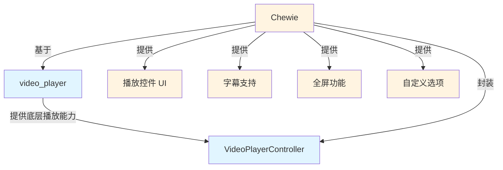

# 第 1 章:库介绍

## 概述

在 Flutter 中构建视频播放功能时，我们通常会用到两个核心库：`video_player` 和 `chewie`。本章将为你介绍这两个库的基本信息、作用和关系。

## video_player - 底层视频播放引擎

`video_player` 是 Flutter 官方提供的视频播放插件,提供了基础的视频播放能力。

### 主要特性

- 跨平台支持（iOS、Android、Web、Desktop）
- 支持本地文件和网络视频播放
- 提供播放控制、进度管理和音频控制
- 轻量级，专注于核心播放功能

### video_player 核心类

- **VideoPlayerController**：视频播放控制器，负责管理视频资源和播放状态
- **VideoPlayerValue**：包含视频播放的当前状态信息（时长、播放位置、缓冲状态等）

### 限制

video_player 只提供核心播放功能，不包含播放控件 UI。如果需要播放按钮、进度条、全屏等界面元素，需要自己实现。

## Chewie - 高级 UI 封装

`Chewie` 是基于 `video_player` 构建的高级视频播放器，提供了开箱即用的播放控件。

### Chewie 主要特性

- 基于 video_player 构建，提供完整 UI 控件
- 支持 Material 和 Cupertino 两种设计风格
- 内置播放/暂停、进度条、全屏、音量控制
- 支持字幕显示和自定义渲染
- 可扩展的配置选项

### Chewie 核心类

- **ChewieController**：Chewie 控制器，封装了 VideoPlayerController 并添加额外功能
- **Chewie**：Chewie 播放器组件，用于在界面中显示视频
- **Subtitle**：字幕数据类
- **OptionItem**：自定义选项菜单项

## 两者的关系



从架构关系图可以看出:

1. **video_player 提供基础**：负责实际的视频解码和播放
2. **Chewie 构建于其上**：提供完整的用户交互界面
3. **分层设计**：Chewie 不会替代 video_player，而是利用其能力并提供更便捷的使用体验

## 为什么选择这两个库

### video_player 的优势

- 官方维护,稳定可靠
- 底层控制能力强
- 适合需要深度定制的场景

### Chewie 的优势

- 快速集成,减少开发时间
- 完整的 UI 控件集
- 良好的跨平台体验
- 灵活的配置选项

### 组合使用的场景

大多数应用会选择同时使用这两个库：

- **video_player**：提供实际的播放能力和状态管理
- **Chewie**：提供用户界面和交互体验

## 依赖配置

在你的 `pubspec.yaml` 中添加以下依赖：

```yaml
dependencies:
  video_player: ^2.10.0
  chewie: ^1.13.0
```

然后运行：

```bash
flutter pub get
```

## 平台配置

### Android

在 `android/app/src/main/AndroidManifest.xml` 中添加网络权限(如果播放网络视频):

```xml
<manifest>
  <uses-permission android:name="android.permission.INTERNET"/>
</manifest>
```

### iOS

如果需要播放网络视频，iOS 会自动处理 App Transport Security 设置。

### Web

确保在 `web/index.html` 中正确配置了 HTML5 视频播放相关的标签。

## 下一步

现在你已经了解了这两个库的基本信息，接下来我们将深入理解它们的核心概念和使用方法。请继续阅读 [第 2 章：核心概念解析](./02-core-concepts.md)
