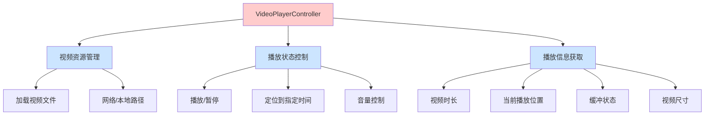
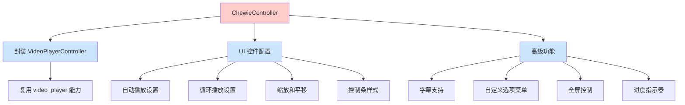
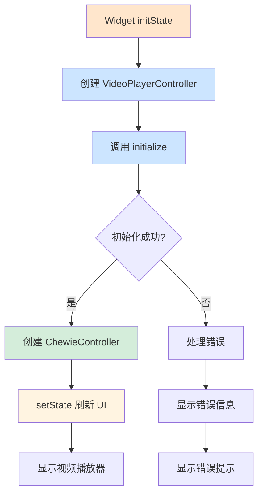
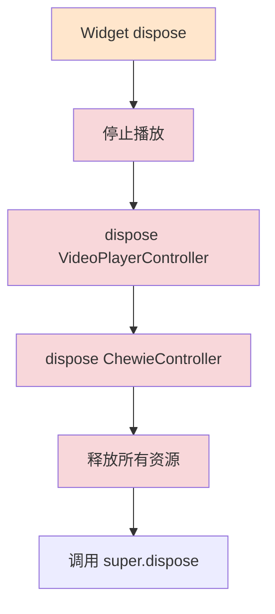

# 第 2 章:核心概念解析

## 概述

要正确使用 Chewie 和 video_player，首先需要理解几个核心概念。本章将深入讲解控制器、生命周期管理和状态管理等关键概念。

## VideoPlayerController - 视频播放控制器

`VideoPlayerController` 是 video_player 库的核心类，负责管理视频播放的所有逻辑。

### 核心职责



### 主要方法

- `initialize()`：初始化视频播放器
- `play()`：开始播放视频
- `pause()`：暂停播放
- `seekTo(Duration)`：跳转到指定时间位置
- `dispose()`：释放资源

### 状态监听

通过 `value` 属性可以获取当前播放状态:

```dart
_videoPlayerController.value.isPlaying  // 是否正在播放
_videoPlayerController.value.duration    // 视频总时长
_videoPlayerController.value.position    // 当前播放位置
_videoPlayerController.value.isBuffering // 是否正在缓冲
```

## ChewieController - Chewie 控制器

`ChewieController` 是 Chewie 库的核心控制器，它封装了 `VideoPlayerController` 并添加了 UI 控制功能。

### ChewieController 职责



### 主要配置选项

- `autoPlay`：是否自动播放
- `looping`：是否循环播放
- `zoomAndPan`：是否支持缩放和平移
- `subtitle`：字幕数据
- `showSubtitles`：是否显示字幕
- `additionalOptions`：自定义选项菜单
- `hideControlsTimer`：控制条自动隐藏时间

## 生命周期管理

正确管理控制器的生命周期至关重要，这直接影响内存使用和应用性能。

### 初始化流程



### 销毁流程



### 代码示例

查看 `app.dart` 中的生命周期管理:

```dart 30:36:example/lib/app/app.dart
  @override
  void dispose() {
    _videoPlayerController1.dispose();
    _videoPlayerController2.dispose();
    _chewieController?.dispose();
    super.dispose();
  }
```

```dart 44:57:example/lib/app/app.dart
  Future<void> initializePlayer() async {
    _videoPlayerController1 = VideoPlayerController.networkUrl(
      Uri.parse(srcs[currPlayIndex]),
    );
    _videoPlayerController2 = VideoPlayerController.networkUrl(
      Uri.parse(srcs[currPlayIndex]),
    );
    await Future.wait([
      _videoPlayerController1.initialize(),
      _videoPlayerController2.initialize(),
    ]);
    _createChewieController();
    setState(() {});
  }
```

## 异步初始化

视频播放器的初始化是一个异步过程，需要使用 `async/await` 正确处理。

### 为什么是异步的

- 网络视频需要下载和解析
- 本地视频需要读取文件
- 解码器需要初始化

### 正确处理异步初始化

```dart
Future<void> initializePlayer() async {
  // 创建控制器
  _videoPlayerController = VideoPlayerController.networkUrl(
    Uri.parse(videoUrl),
  );
  
  // 等待初始化完成
  await _videoPlayerController.initialize();
  
  // 创建 Chewie 控制器
  _createChewieController();
  
  // 刷新 UI
  setState(() {});
}
```

### 初始化状态检查

在 UI 构建时,必须检查控制器是否已初始化:

```dart 181:195:example/lib/app/app.dart
                child:
                    _chewieController != null &&
                        _chewieController!
                            .videoPlayerController
                            .value
                            .isInitialized
                    ? Chewie(controller: _chewieController!)
                    : const Column(
                        mainAxisAlignment: MainAxisAlignment.center,
                        children: [
                          CircularProgressIndicator(),
                          SizedBox(height: 20),
                          Text('Loading'),
                        ],
                      ),
```

## 状态管理

### 控制器状态变化

视频播放器的状态会不断变化，需要通过监听器更新 UI。

### ValueNotifier 模式

`VideoPlayerController` 使用 `ValueNotifier` 来通知状态变化：

```dart
_videoPlayerController.addListener(() {
  setState(() {});
});
```

### 或使用 ChewieController 的状态

Chewie 会自动处理状态监听，你只需要在需要时调用 `setState()`。

## 多视频控制器管理

在一些场景下，你可能需要同时管理多个视频控制器。

在示例代码中：

```18:21:example/lib/app/app.dart
  TargetPlatform? _platform;
  late VideoPlayerController _videoPlayerController1;
  late VideoPlayerController _videoPlayerController2;
  ChewieController? _chewieController;
```

这样做可以：

- 支持多个视频源
- 在运行时切换视频
- 预先加载备选视频

## 下一步

现在你已经理解了核心概念，接下来我们将深入分析示例代码的每个部分。请继续阅读 [第 3 章：代码逐段解析](./03-code-analysis.md)
