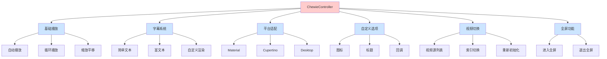

# 第 4 章:功能特性详解

## 概述

本章将深入探索 Chewie 的各种强大功能,包括字幕系统、平台适配、自定义选项、视频切换和全屏功能等。

## 字幕功能

字幕是视频播放器的重要功能之一,Chewie 提供了灵活的字幕支持。

### 简单文本字幕

最基本的字幕类型,直接使用字符串:

```dart
Subtitle(
  index: 0,
  start: const Duration(seconds: 10),
  end: const Duration(seconds: 20),
  text: '这是简单文本字幕',
),
```

### 富文本字幕

使用 `TextSpan` 创建多行富文本:

```dart 75:107:example/lib/app/app.dart
    final subtitles = [
      Subtitle(
        index: 0,
        start: Duration.zero,
        end: const Duration(seconds: 10),
        text: const TextSpan(
          children: [
            TextSpan(
              text: 'Hello',
              style: TextStyle(color: Colors.red, fontSize: 22),
            ),
            TextSpan(
              text: ' from ',
              style: TextStyle(color: Colors.green, fontSize: 20),
            ),
            TextSpan(
              text: 'subtitles',
              style: TextStyle(color: Colors.blue, fontSize: 18),
            ),
          ],
        ),
      ),
      Subtitle(
        index: 0,
        start: const Duration(seconds: 10),
        end: const Duration(seconds: 20),
        text: 'Whats up? :)',
        // text: const TextSpan(
        //   text: 'Whats up? :)',
        //   style: TextStyle(color: Colors.amber, fontSize: 22, fontStyle: FontStyle.italic),
        // ),
      ),
    ];
```

**特性说明:**

- 可以在同一行使用不同的颜色和大小
- 支持多个 `TextSpan` 组合
- 每个 `TextSpan` 可以独立设置样式

### 自定义字幕渲染

完全控制字幕的显示方式:

```dart 129:137:example/lib/app/app.dart
      subtitleBuilder: (context, dynamic subtitle) => Container(
        padding: const EdgeInsets.all(10.0),
        child: subtitle is InlineSpan
            ? RichText(text: subtitle)
            : Text(
                subtitle.toString(),
                style: const TextStyle(color: Colors.black),
              ),
      ),
```

**关键点:**

- `subtitle` 参数类型为 `dynamic`,需要判断类型
- 富文本字幕使用 `RichText` 渲染
- 普通字幕使用 `Text` 渲染

### 字幕数据结构

每个字幕对象包含:

- `index`: 字幕轨道索引(支持多轨道)
- `start`: 字幕开始时间
- `end`: 字幕结束时间
- `text`: 字幕内容(支持字符串或 `InlineSpan`)

## 平台适配

Chewie 支持不同的平台控件风格,可以灵活切换。

### Material Design (Android)

```dart
_platform = TargetPlatform.android;
```

- 遵循 Material Design 设计规范
- 适合 Android 平台

### Cupertino (iOS)

```dart
_platform = TargetPlatform.iOS;
```

- 遵循 iOS 设计规范
- 适合 iPhone 和 iPad

### Desktop

```dart
_platform = TargetPlatform.windows;
// 或
_platform = TargetPlatform.macOS;
// 或
_platform = TargetPlatform.linux;
```

- 适合桌面应用

### 动态切换

在运行时切换平台风格:

```dart 263:292:example/lib/app/app.dart
            Row(
              children: <Widget>[
                Expanded(
                  child: TextButton(
                    onPressed: () {
                      setState(() {
                        _platform = TargetPlatform.android;
                      });
                    },
                    child: const Padding(
                      padding: EdgeInsets.symmetric(vertical: 16.0),
                      child: Text("Android controls"),
                    ),
                  ),
                ),
                Expanded(
                  child: TextButton(
                    onPressed: () {
                      setState(() {
                        _platform = TargetPlatform.iOS;
                      });
                    },
                    child: const Padding(
                      padding: EdgeInsets.symmetric(vertical: 16.0),
                      child: Text("iOS controls"),
                    ),
                  ),
                ),
              ],
            ),
```

## 自定义选项菜单

添加额外的功能菜单项。

### 定义选项

```dart 118:126:example/lib/app/app.dart
      additionalOptions: (context) {
        return <OptionItem>[
          OptionItem(
            onTap: (context) => toggleVideo(),
            iconData: Icons.live_tv_sharp,
            title: 'Toggle Video Src',
          ),
        ];
      },
```

### 添加多个选项

```dart
additionalOptions: (context) {
  return <OptionItem>[
    OptionItem(
      onTap: (context) => {
        // 功能 1
      },
      iconData: Icons.settings,
      title: '设置',
    ),
    OptionItem(
      onTap: (context) => {
        // 功能 2
      },
      iconData: Icons.download,
      title: '下载',
    ),
    OptionItem(
      onTap: (context) => {
        // 功能 3
      },
      iconData: Icons.share,
      title: '分享',
    ),
  ];
},
```

### 选项数据结构

每个 `OptionItem` 包含:

- `onTap`: 点击回调函数
- `iconData`: 图标数据
- `title`: 标题文本

## 视频源切换

在运行时动态切换视频源。

### 简单的视频切换

```dart 159:166:example/lib/app/app.dart
  Future<void> toggleVideo() async {
    await _videoPlayerController1.pause();
    currPlayIndex += 1;
    if (currPlayIndex >= srcs.length) {
      currPlayIndex = 0;
    }
    await initializePlayer();
  }
```

**实现步骤:**

1. 暂停当前播放
2. 更新视频索引
3. 重新初始化播放器

### 切换控制器的视频

使用 `copyWith()` 方法:

```dart 222:252:example/lib/app/app.dart
                  child: TextButton(
                    onPressed: () {
                      setState(() {
                        _videoPlayerController2.pause();
                        _videoPlayerController2.seekTo(Duration.zero);
                        _chewieController = _chewieController!.copyWith(
                          videoPlayerController: _videoPlayerController2,
                          autoPlay: true,
                          looping: true,
                          /* subtitle: Subtitles([
                            Subtitle(
                              index: 0,
                              start: Duration.zero,
                              end: const Duration(seconds: 10),
                              text: 'Hello from subtitles',
                            ),
                            Subtitle(
                              index: 0,
                              start: const Duration(seconds: 10),
                              end: const Duration(seconds: 20),
                              text: 'Whats up? :)',
                            ),
                          ]),
                          subtitleBuilder: (context, subtitle) => Container(
                            padding: const EdgeInsets.all(10.0),
                            child: Text(
                              subtitle,
                              style: const TextStyle(color: Colors.white),
                            ),
                          ), */
                        );
                      });
                    },
                    child: const Padding(
                      padding: EdgeInsets.symmetric(vertical: 16.0),
                      child: Text("Portrait Video"),
                    ),
                  ),
```

**优势:**

- 不需要重新创建整个控制器
- 保留大部分配置
- 只更新必要的属性

## 全屏功能

提供编程方式进入全屏。

### 进入全屏

```dart 198:203:example/lib/app/app.dart
            TextButton(
              onPressed: () {
                _chewieController?.enterFullScreen();
              },
              child: const Text('Fullscreen'),
            ),
```

### 退出全屏

用户可以通过播放器控制条上的退出按钮退出全屏,也可以编程方式:

```dart
_chewieController?.exitFullScreen();
```

## 播放配置选项

### 自动播放

```dart
autoPlay: true,
```

视频加载完成后自动开始播放。

### 循环播放

```dart
looping: true,
```

视频播放结束后自动重新开始。

### 缩放和平移

```dart
zoomAndPan: true,
```

允许用户使用手势进行缩放和平移操作。

### 控制条隐藏时间

```dart
hideControlsTimer: const Duration(seconds: 1),
```

设置控制条自动隐藏的延迟时间。

### 进度指示器延迟

```dart
progressIndicatorDelay: bufferDelay != null
    ? Duration(milliseconds: bufferDelay!)
    : null,
```

控制缓冲指示器的显示延迟,避免频繁闪烁。

## 其他配置选项

### 显示控制条

```dart
showControls: true,  // 默认 true
```

### 进度条颜色

```dart
materialProgressColors: ChewieProgressColors(
  playedColor: Colors.red,
  handleColor: Colors.blue,
  backgroundColor: Colors.grey,
  bufferedColor: Colors.lightGreen,
),
```

### 占位符

```dart
placeholder: Container(
  color: Colors.grey,
  child: Center(
    child: CircularProgressIndicator(),
  ),
),
```

### 自动初始化

```dart
autoInitialize: true,
```

## 功能流程图



## 下一步

现在你已经了解了 Chewie 的各种强大功能,接下来我们将学习如何优雅地使用这些功能。请继续阅读 [第 5 章:最佳实践](./05-best-practices.md)
